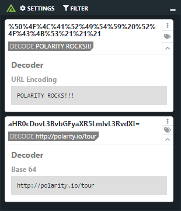

# Polarity String Decoder Integration

> This integration should only be run in `On Demand Only` mode

The Polarity string decoder integration supports decoding of Base64 and URL Encoded strings

## About Polarity

Polarity is a memory-augmentation platform that improves and accelerates analyst decision making.  For more information about the Polarity platform please see:

https://polarity.io/
